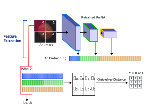
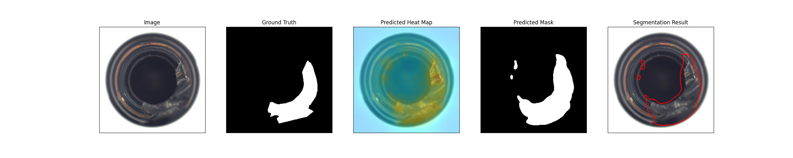
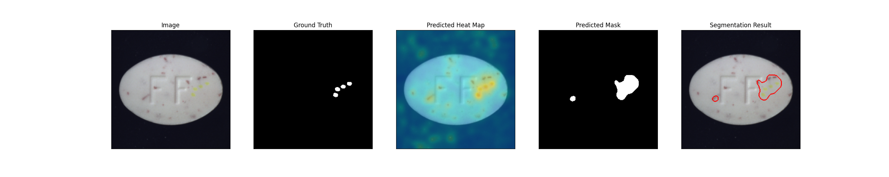
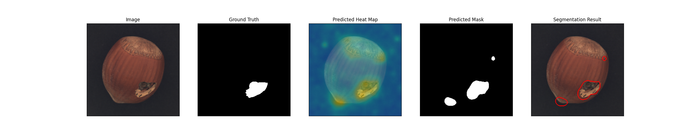

# PaDiM: A Patch Distribution Modeling Framework for Anomaly Detection and Localization

This is the implementation of the my paper [Anomaly Detection Based on a Hybrid Gaussian-Chebyshev Based Method for Industrial Dataset](https://drive.google.com/file/d/1TBi6MwfZQGrKRUIYos0N-JYTQbuWT9uN/view?usp=share_link)

Some of the code is borrowed from [PaDiM](https://arxiv.org/pdf/2011.08785.pdf) paper.

Model Type: Segmentation

## Description

Detecting anomaly products is a challenging task in industrial manufacturing. The anomaly detection problem is usually formulated as one-class learning or cold start problem. Typically, the procedure can be divided into two parts: feature extraction and distribution estimation. While the feature extraction part is mainly using embeddings from ImageNet model, there are multiple methods competing in the distribution estimation part. One of the methods is to fit the data distribution with Gaussian-based distribution estimator. Considering Gaussian estimator has less ability to analyze the samples further from the mean of the distribution. And the data distribution may not conform to bell-shape. While the Gaussian estimator performs excellent, the gap remains between these works and 100% AUROC. As a result, this work analyzes the distributions in MVTec AD dataset and use the none-parametric distribution assumption. By proposing Chebyshev anomaly policy and a none-parametric method, the experimental results reveal that corresponding distribution method may improve texture analysis and fixes the distribution bias in pixel level, and improve the pixel AUROC by 0.02%.

Keywords: Anomaly Detection, Smart Manufacturing, Gaussian Mixture Model, Chebyshev’s Inequality, Machine Learning

## Architecture

## Usage

down load [anomalib](https://github.com/winniepooh520/anomalib_main)
and replace the folder "anomalib_main/anomalib/models/padim/" with this folder
and:

`python tools/train.py --model padim`

## Benchmark

All results gathered with seed `42`.

## [MVTec AD Dataset](https://www.mvtec.com/company/research/datasets/mvtec-ad)

### Sample Results

